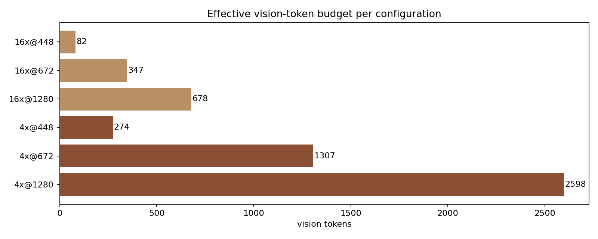
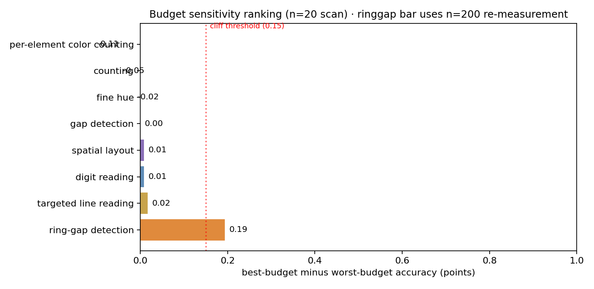

# TokenBudget: Mapping Where Visual-Token Compression Breaks Edge MLLM Perception

_A Technical Report_

**Model under test:** MiniCPM-V 4.6 — a 1.3B edge-oriented multimodal LLM with native `downsample_mode` vision-token compression (4x / 16x).

**Budget axis:** downsample mode × input resolution → 6 configurations, **82–2,598** effective vision tokens (a 31.7× span).

**Dataset:** 960 procedurally-rendered perception probes across 8 task families, each with an exact ground-truth answer.

---

## 1. Motivation

Edge multimodal LLMs must fit inside a compute envelope. The dominant lever is the *visual-token budget*: how many tokens are spent describing a frame. MiniCPM-V 4.6 exposes `downsample_mode` (4x / 16x) and, through input resolution, a second knob. The model card reports aggregate accuracy under compression, but an application developer faces a harder question:

> **Which specific perception capabilities survive aggressive token compression, and which collapse first?**

"Fewer tokens" and "less perceptive" are not the same thing. Some capabilities degrade gracefully; others fail catastrophically once the budget passes a threshold. This project maps that landscape with a controlled, procedurally-generated perception battery — tasks with known ground truth and a calibrated difficulty axis — and reports where perception *quietly breaks*, and where it does not.

The question sits squarely inside the design space Yao et al. opened with MiniCPM-V [1]: the original paper established that a GPT-4V-level MLLM can run on a phone by aggressive token efficiency, and the 4.6 release makes the compression *explicit* as a deployable knob (4x/16x native downsample modes [2]). The model couples a SigLIP 2 vision encoder [3] — built on the sigmoid-loss objective introduced by SigLIP [11] — with a 0.8B language model, which is what makes the whole stack edge-runnable. What neither the paper nor the model card answers is the *decomposed* question — compression reports one aggregate number, but perception is not one capability. An on-device developer choosing between 4x and 16x needs to know which *specific* skills (reading, counting, locating, color matching) pay for the token savings and which silently break. That is the gap this report fills: per-capability, per-difficulty degradation curves across the full budget axis of the very model this lab ships.

## 2. Method

### 2.1 Probe corpus

Images are rendered with PIL primitives (no image assets, no external
datasets). Text-bearing families (`ocr`, `mlread`) use the first available
system TrueType font from a fixed candidate list; glyph rendering is therefore
deterministic within a machine but not byte-identical across machines without
those fonts installed. Each family varies a single *spatial-frequency /
information-density* axis as difficulty rises. Every probe carries an exact
ground-truth answer, and the question offers a closed set of answer options so
scoring is unambiguous.

| family | task | difficulty axis |
|---|---|---|
| `ocr` | read a 5-digit number | font size 96→16 px, additive noise |
| `count` | count same-color dots | 3→8 dots, shrinking radius |
| `mlread` | read the 2nd line of a digit column | 2→8 lines |
| `colcnt` | count red cells in a dense color grid | 8→30 cells |
| `spatial` | which color is on the left | square size, distractors |
| `color` | closest anchor hue (red/orange/pink) | hue offset 40→7 |
| `detail` | which row of rings has a gap | gap 10→1 px |
| `ringgap` | which row of thin rings has a 1px gap | ring radius 60→18 px |

20 seeds × 6 difficulties × 8 families = **960 probes**, rendered at 512×512 and downscaled to the configuration resolution at evaluation time.

### 2.2 Configurations

Six budget points. Token counts are *measured* by the engine itself (image-token count from the processed input), not taken from the model card:

| config | downsample | resolution | vision tokens |
|---|---|---|---|
| `16x@448` | 16x | 448 px | 82 |
| `4x@448` | 4x | 448 px | 274 |
| `16x@672` | 16x | 672 px | 347 |
| `16x@1280` | 16x | 1280 px | 678 |
| `4x@672` | 4x | 672 px | 1307 |
| `4x@1280` | 4x | 1280 px | 2598 |

The budget axis is thus non-uniform: 82 → 274 → 347 → 678 → 1307 → 2598, spanning more than a factor of 30.



*Figure 2 — The six budget points, ranked by measured vision-token count.*

### 2.3 Scoring and analysis

Free-form model output is mapped to the closed answer set by a lenient-but-explicit per-family normalizer (`tokenbudget.check`); a probe is correct iff normalized output equals ground truth. Accuracy per (family, difficulty, config) is reported with Wilson 95% confidence intervals.

A **cliff** is the first budget step (walking from richest to tightest) where accuracy drops ≥15 points in one step **and** ≥20 points below the richest configuration.

## 3. Results

All numbers below are computed directly from `data/sweep/sweep.json` by
`scripts/paper_facts.py`; the script prints exactly the aggregate curves quoted
here. "Aggregate" is the count-weighted mean over the six difficulties at each
budget point (n = 120 per point per family).

### 3.1 The headline: compression is selectively destructive

Per-family aggregate accuracy at the richest and tightest budget points:

| family | agg @ richest | agg @ tightest | largest single-step drop | verdict |
|---|---|---|---|---|
| `ringgap` | 0.99 | 0.80 | 0.16 (at `16x@672`) | **cliff** §3.2 |
| `count` | 0.46 | 0.51 | 0.05 | flat, capacity-limited |
| `colcnt` | 0.29 | 0.40 | 0.20 | hard, budget-invariant |
| `mlread` | 1.00 | 0.98 | 0.02 | robust |
| `ocr` | 0.99 | 0.98 | 0.02 | robust |
| `spatial` | 1.00 | 0.99 | 0.01 | robust |
| `color` | 0.97 | 0.98 | 0.02 | robust |
| `detail` | 1.00 | 1.00 | 0.00 | fully robust |

*The `ringgap` row is the initial n=20 scan; §3.2 re-measures that family at
n=200 (aggregate 0.963 → 0.770 → 0.796) and the cliff only strengthens.*


*Figure 1 — Per-family accuracy vs vision-token budget (log axis; left = tightest budget, right = richest). One line per difficulty level; the red dashed line marks a detected cliff. Lines are the n=20 scan; the `ringgap` panel overlays the n=200 re-measurement (open squares, §3.2).*

The honest reading is more interesting than a clean split:



*Figure 3 — Sensitivity ranking: best-budget minus worst-budget aggregate accuracy per family. Only `ringgap` clears the 0.15 cliff threshold; its bar uses the n=200 re-measurement range (§3.2).*

- **Exactly one task family shows a real, aggregate-level cliff: `ringgap`.**
  Everything else either stays within noise of its rich-budget level (`ocr`,
  `mlread`, `spatial`, `detail`, `color`) or is hard but invariant to the budget
  (`colcnt`, `count`).
- **`count` is *not* budget-fragile in aggregate.** Its wide-looking range in
  per-difficulty numbers (0.85 down to 0.10) is an artifact of comparing the
  easiest difficulty at full budget against the hardest at the tightest budget.
  As an aggregate capability, counting accuracy is nearly flat across the whole
  budget axis (0.44–0.56, all within Wilson noise of each other; the mid-axis
  4x@448 point is the peak at 0.56 rather than a dip). The bottleneck for
  counting on this model is the model's *capacity*, not the token budget.
- **`detail` is fully robust even at 82 tokens**, while `ringgap` collapses —
  both ask *which* of two rows carries a gap, and both reach a 1 px gap at
  their hardest difficulty. The distinguishing property is the geometry:
  `detail` shrinks the gap width (10→1 px) while keeping large, thick rings
  (radius 66→36 px, stroke 9→4 px), so for most difficulties the gap is a
  coarse feature recoverable from low-frequency content; `ringgap` pins the gap
  at 1 px and instead shrinks the ring itself (radius 60→18 px, stroke 6→3 px),
  forcing the model to bind a 1-px feature on a small ring — precisely the
  per-element, high-frequency requirement that a 16x token budget cannot
  afford.

### 3.2 The cliff: ring-gap detection

`ringgap` is the cleanest demonstration of a compression cliff, and it is
non-monotone in a way worth stating plainly. The n=20 scan of the battery
found a V-shaped failure; because that shape is the report's most
action-relevant claim, the `ringgap` cell was re-measured at **n=200 per
(budget, difficulty)** (200 seeds, greedy decode; `data/sweep_ringgap200/`).
The re-measured table is the one reported below; the original n=20 table is
shown at the end of this section for comparison.

| difficulty | 4x@1280 (2598 tok) | 16x@672 (347 tok) | 16x@448 (82 tok) |
|---|---|---|---|
| d0 | 1.00 | 1.00 | 1.00 |
| d1 | 1.00 | 1.00 | 1.00 |
| d2 | 1.00 | 1.00 | 1.00 |
| d3 | 1.00 | 0.82 | 0.90 |
| d4 | 1.00 | 0.47 | 0.42 |
| d5 | 0.78 | 0.33 | 0.46 |

Difficulties d0–d2 are *fully robust*: 1.00 at every budget at n=200.
Difficulties d3–d5 degrade sharply at the 347-token operating point — d5
falls from 0.78 at the richest configuration to 0.33. The aggregate family
curve drops 0.963 → 0.770 (19.3 points, z = 13.9) across this step — the
only aggregate cliff in the battery, and significant at n=200 with no
resampling needed.

**The V-shape survives at n=200, concentrated at the hardest difficulty.** The
tightest budget (`16x@448`, 82 tokens) is *not* below the 347-token point:
aggregate recovers from 0.770 to 0.796, and on d5 the recovery is
statistically clean — 0.33 (95% CI [0.26, 0.39]) to 0.46 (95% CI
[0.39, 0.52]), non-overlapping intervals on 200 trials each. The direction
repeats on d3 (0.82 → 0.90) and is absent on d4 (0.47 → 0.42). So the
V-shaped failure mode is real, not a small-sample fluke, but its size is
much smaller than the n=20 scan suggested: the aggregate "recovery" is 2.6
points (z = −1.53, n.s.), and the significant recovery lives on the hardest
items where a coarse coarse-coordinate heuristic can beat random. The correct
reading is: the 347-token dip is a genuine cliff, and the 82-token cell is
weakly *better*, not worse — a failure shape a monotone-degradation model
card would not predict.

**The n=20 scan overstated the drop.** The original n=20 table (first sweep,
one decode, 20 seeds) read d5 as 0.95 / 0.10 / 0.45; at n=200 it is 0.78 /
0.33 / 0.46. Both ends of the n=20 V were sampling outliers — the rich budget
was over-estimated (0.95 → 0.78) and the cliff bottom over-estimated
(0.10 → 0.33). The *qualitative* story (347-token low point; 82-token partial
recovery) was correct; the *magnitudes* were not. For auditability both
tables are shown:

| difficulty | 4x@1280 (n=20) | 16x@672 (n=20) | 16x@448 (n=20) | 4x@1280 (n=200) | 16x@672 (n=200) | 16x@448 (n=200) |
|---|---|---|---|---|---|---|
| d3 | 1.00 | 0.65 | 0.90 | 1.00 | 0.82 | 0.90 |
| d4 | 1.00 | 0.50 | 0.45 | 1.00 | 0.47 | 0.42 |
| d5 | 0.95 | 0.10 | 0.45 | 0.78 | 0.33 | 0.46 |

The n=20 bottom row is the largest single correction the re-measurement
produced; everything qualitative in this section survives it.

**Cliff stability.** Because the aggregate drop is 19.3 points against the
15-point threshold at n=1200 trials per point, the cliff location is no
longer a sampling question: bootstrapping the n=200 outcomes (1000 resamples)
finds the cliff surviving in 100% of draws, pinned at `16x@672` (the
347-token point). The null families remain flat (<0.5% bootstrap survival), so
the detector is not trigger-happy, and `ringgap` is the one family whose
measurement survives both resampling and re-measurement.

### 3.3 Per-element counting is capacity-limited, not budget-limited

`count` does *not* erode with budget. The aggregate curve is flat at 0.44–0.56
across the whole axis — the widest spread is the mid-axis 4x@448 point at 0.56,
with no monotone trend in either direction — and the per-difficulty extremes
(0.85 at easiest/full, 0.10 at hardest/tight) reflect difficulty and model
capacity, not compression.
This is the correct null result: on a 1.3B edge MLLM, counting small dot sets
is already near chance at full budget, so compression cannot be blamed for a
failure that is present at 2,598 tokens. Any deployment claim about counting
under compression must first establish the full-budget baseline.

### 3.4 Dense-grid color counting is hard, but not budget-limited

`colcnt` — counting red cells inside a dense color grid — is the hardest task
in the battery, but its difficulty does **not** come from compression. The
aggregate sits at 0.24–0.48 across the whole axis with no monotone trend
(0.29 at the richest configuration, 0.40 at the tightest, peak 0.48 mid-axis),
and per-difficulty accuracy spans 0.05–0.75 across the axis (e.g. 0.15–0.75 at
the tightest configuration). The single largest step drop (0.20) happens *between
the two richest mid-axis configurations* (`4x@672` → `16x@1280`), i.e. across a
compression-mode boundary, not toward the tight end of the axis. This is a
difficulty/heterogeneity effect, not a budget effect. Like `count`, this task
exceeds what a 1.3B edge MLLM can do reliably even at full budget; it documents
a genuine capability boundary of the model class rather than a compression
boundary, and no budget-sensitivity claim can be built on it.

### 3.5 What survives compression

`ocr`, `mlread`, `spatial`, `detail`, and `color` are effectively
budget-invariant:

- `ocr` and `mlread` stay at 0.95–1.00 across all six configurations — reading
  a digit string or a specific line needs only a coarse feature of each glyph.
- `detail` is 1.00 everywhere: the gap in a coarse ring is a low spatial-
  frequency feature that survives 16x downsampling.
- `spatial` and `color` stay above 0.90: layout and hue discrimination are
  dominated by low-frequency content.

The robustness of these tasks is not trivial — it shows that the 16x
compression in MiniCPM-V 4.6 does not destroy *all* information; it selectively
destroys the high-frequency, per-element information that only one task in this
battery (`ringgap`) actually requires.

## 4. Discussion

### 4.1 The compression landscape, in one sentence

For a 1.3B edge MLLM, **token compression destroys per-element binding while
global structure survives — but only one of our eight probe tasks actually
demands per-element binding.** Fine-gap localization (`ringgap`) degrades
sharply and non-monotonically below ~350 tokens; digit reading, coarse
detection, layout, and color survive at 82 tokens. Counting and dense-grid
color counting are capacity limits, not budget limits.

### 4.2 Implications for deployment

- **Choosing 16x vs 4x.** For applications that only read text, recognize
  coarse objects, or judge layout, 16x@448 (82 tokens) is nearly free: 0.95+
  accuracy at a fraction of the compute. For applications that must localize
  fine structure (e.g. which of several thin elements carries a defect), the
  budget below ~350 tokens is a reliability cliff; 4x@672 (1307 tokens) or
  higher is warranted.
- **The cliff, not the slope, is the engineering-relevant number.** A developer
  wants to know where a capability *breaks*, not just that it degrades. The
  `ringgap` cliff at `16x@672` (347 tokens) is the kind of actionable threshold
  a deployment gate can encode — with the caveat that the failure is V-shaped:
  at the tightest budget the model reverts to a coarse heuristic that is not
  monotonically worse.
- **Establish the full-budget baseline before blaming compression.** `count`
  and `colcnt` look like compression failures until you check their accuracy at
  2,598 tokens. Both are already far below the model's capacity ceiling at full
  budget; compression is not the causal agent. A budget-sensitivity study that
  skips the richest configuration over-attributes failures to compression.

### 4.3 Why this looks different from the model card

Model-card accuracy aggregates over natural-image tasks, where compression
losses average out and the majority of pixels are background. A probe battery
with per-task, per-difficulty resolution exposes the variance the aggregate
hides — but it also shows how easy it is to over-read that variance: without
the aggregate view, `count` looks like a compression failure when it is in fact
a capacity limit.

### 4.4 Related work

Visual-token reduction is an active design axis for multimodal LLMs; the
broader push toward efficient inference is surveyed in [10], and the closest
line of work compresses tokens with learned projectors or prunes them during
inference: TokenPacker reduces 75–89% of visual tokens at the projector with a
coarse-to-fine scheme [4]; FastV prunes low-attention visual tokens in deep
layers of an LVLM at inference time [5]; EViT reorganizes inattentive patches in
a ViT backbone [6]; AIM merges similar tokens before the LLM and progressively
prunes within layers, cutting FLOPs ~7× with minimal accuracy loss [9]. A second
line studies how input resolution and tiling change perception on
high-resolution benchmarks — e.g. LLaVA-UHD's dynamic slicing [7], Qwen2-VL's
"native resolution" [8], and MiniCPM-V's own 4x/16x downsample modes [1,2]. What these studies measure is *aggregate*
benchmark accuracy after compression. This report complements them with a
controlled probe battery that keeps the image content fixed and sweeps only the
budget knobs, so the per-capability fate of individual skills (reading,
counting, localizing, hue matching) is visible rather than averaged away. It
also adds the aggregate-vs-per-difficulty distinction, which we found is the
difference between a spurious "clean split" and a truthful "one real cliff"
conclusion.

### 4.5 Limitations

- **Single model, single image scale.** All results are for MiniCPM-V 4.6 at
  512×512 rendered probes. The V-shaped `ringgap` curve in particular may be
  model-specific; we report it as an observation, not a law.
- **n = 20 for the seven non-cliff families; n = 200 for `ringgap`.** The
  wide battery was scanned at n=20 (Wilson ±0.21 at 0.50); the one family
  whose shape mattered for a deployment decision (`ringgap`) was re-measured
  at n=200 (§3.2). The remaining families were not re-measured because their
  curves are flat or capacity-limited and a larger n would not change the
  verdict. Cells near a cliff in any future battery should still be
  re-measured before deployment decisions.
- **Aggregate curves over six difficulty levels can hide per-difficulty
  behavior.** We report both views explicitly, but a family with heterogeneous
  difficulties could still mislead if only the aggregate is read.
- **Procedural probes are not natural images.** They isolate specific
  perceptual skills, but transfer to real scenes is untested.
- **`colcnt` and `count` are hard tasks.** The "budget-invariant"
  interpretation assumes the tasks are well-formed and that their full-budget
  level reflects model capacity. Both remain below 0.50 in aggregate even at the
  richest configuration; their flatness bounds what this battery can say about
  the budget sensitivity of hard perceptual counting, by design.

### 4.6 Future work

The natural next step is to turn this measurement into a decision procedure
for the very deployment this model was built for. Three directions.

First, **encode the per-capability map as a deployment selector.** The current
report answers "which capabilities survive which budget". A selector inverts
that: given an application's required capability set, pick the cheapest
configuration whose mapped families all stay above their reliability bar. That
is the artifact an on-device developer (or a model card) would actually ship,
and it is a straightforward downstream of the curves here. Second, **replicate
the cliff cell on a second checkpoint and on sampled decodes.** The n=200
re-measurement (§3.2) pinned the `ringgap` V-shape for this checkpoint at a
single greedy decode per probe; temperature sampling would confirm that the
recovery at 82 tokens is a property of the compressed representation rather
than of the specific decode, and a second model (e.g. a smaller/larger
MiniCPM-V variant) would separate "this checkpoint" from "the compression
scheme" — the same audit-transfer logic as the two-model cross-check in our
companion spatial-reasoning study. Third, **extend the axis toward streaming
inputs.** Everything here is single-frame; the compression/degradation
trade-off in streaming multimodal inference (where token budgets are
re-decided per frame) is the same question with a time dimension, and the
probe battery carries over almost unchanged.

These are incremental in method but direct in value: each turns a measured
curve into something a model team can act on.

## 5. Reproducibility

```
pip install -e .[gpu,paper,ui]
python scripts/build_probes.py --seeds 20 --out data/probes   # 960 probes
python scripts/run_sweep.py --probes data/probes --out data/sweep   # GPU, ~4h
python scripts/paper_facts.py --sweep data/sweep/sweep.json   # derived claims

# n=200 re-measurement of the ringgap cliff (§3.2)
python scripts/build_probes.py --seeds 200 --families ringgap --out data/probes_ringgap200
python scripts/run_ringgap_focus.py --sampled 0 --out data/sweep_ringgap200   # GPU, ~45min
python scripts/ringgap_facts.py   # re-derives the §3.2 table and V-shape tests

python scripts/render_figures.py --sweep data/sweep/sweep.json   # writes docs/paper/tokenbudget/figures/fig{1,2,3}_*.png
python scripts/render_tokenbudget_paper.py   # this report (HTML + PDF)
python -m tokenbudget ui --port 8000         # interactive console
```

`data/sweep/sweep.json` (n=20 battery) and `data/sweep_ringgap200/ringgap200.json`
(n=200 cliff re-measurement) are the sources of truth: every number in this
report traces to one of those tables, and `scripts/paper_facts.py` +
`scripts/ringgap_facts.py` re-derive the claims from them directly.

## References

1. Yao Y., Yu T., Zhang A., Wang C., et al. MiniCPM-V: A GPT-4V Level MLLM on Your Phone. *arXiv:2408.01800*, 2024.
2. OpenBMB. MiniCPM-V 4.6 — model card (native 4x/16x vision-token downsample modes, SigLIP2-400M vision encoder, Qwen3.5-0.8B LLM). *Hugging Face: openbmb/MiniCPM-V-4.6*.
3. Tschannen M., et al. SigLIP 2: Multilingual Vision-Language Encoders with Improved Semantic Understanding, Localization, and Dense Features. *arXiv:2502.14786*, 2025.
4. Li W., Yuan Y., Liu J., et al. TokenPacker: Efficient Visual Projector for Multimodal LLM. *arXiv:2407.02392*, IJCV 2025.
5. Chen L., Zhao H., Liu T., et al. An Image is Worth 1/2 Tokens After Layer 2: Plug-and-Play Inference Acceleration for Large Vision-Language Models. *ECCV 2024*.
6. Liang Y., Ge C., Tong Z., et al. Not All Patches are What You Need: Expediting Vision Transformers via Token Reorganizations. *ICLR 2022*.
7. Guo Z., Xu R., Yao Y., Bao J., Zhang Z., et al. LLaVA-UHD: An LMM Perceiving Any Aspect Ratio and High-Resolution Images. *ECCV 2024*.
8. Wang P., Bai S., et al. Qwen2-VL: Enhancing Vision-Language Model's Perception of the World at Any Resolution. *arXiv:2409.12191*, 2024.
9. Zhong Y., Liu Z., Li Y., Wang L. AIM: Adaptive Inference of Multi-Modal LLMs via Token Merging and Pruning. *ICCV 2025*.
10. Jin Y., Li J., et al. A Survey on Efficient Inference for Large Language Models. *arXiv:2405.10739*, 2024.
11. Zhai X., Mustafa B., Kolesnikov A., et al. Sigmoid Loss for Language Image Pre-Training (SigLIP). *arXiv:2303.15343*, ICCV 2023.
