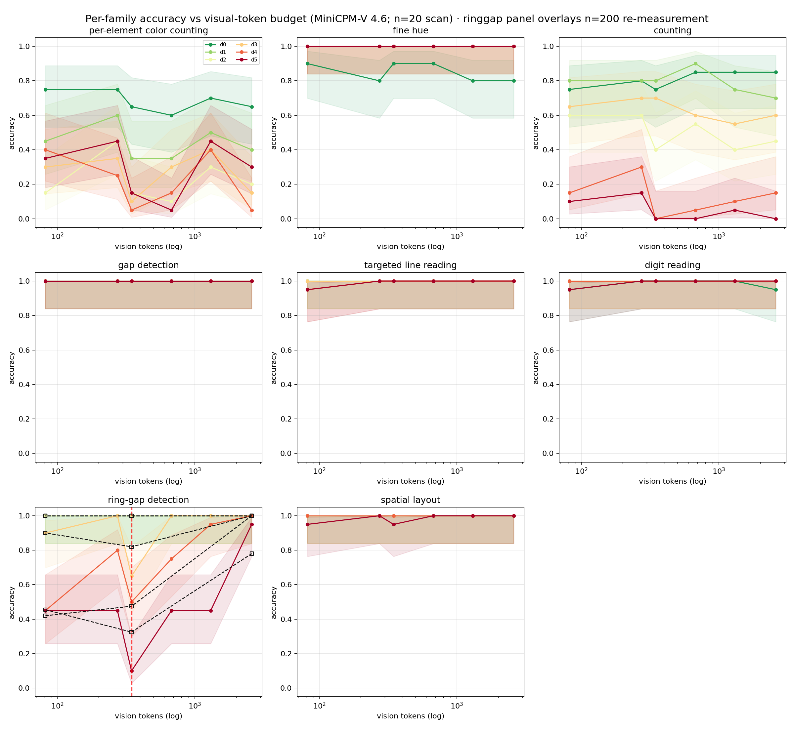

# TokenBudget: Mapping Where Visual-Token Compression Breaks Edge MLLM Perception

_A Technical Report_

**Model under test:** MiniCPM-V 4.6 — a 1.3B edge-oriented multimodal LLM with native `downsample_mode` vision-token compression (4x / 16x).

**Budget axis:** downsample mode × input resolution → 6 configurations, **82–2,598** effective vision tokens (a 31.7× span).

**Dataset:** 960 procedurally-rendered perception probes across 8 task families, each with an exact ground-truth answer.

---

## 1. Motivation

Edge multimodal LLMs must fit inside a compute envelope. The dominant lever is the *visual-token budget*: how many tokens are spent describing a frame. MiniCPM-V 4.6 exposes `downsample_mode` (4x / 16x) and, through input resolution, a second knob. The model card reports aggregate accuracy under compression, but an application developer faces a harder question:

> **Which specific perception capabilities survive aggressive token compression, and which collapse first?**

"Fewer tokens" and "less perceptive" are not the same thing. Some capabilities degrade gracefully; others fail catastrophically once the budget passes a threshold. This project maps that landscape with a controlled, procedurally-generated perception battery — tasks with known ground truth and a calibrated difficulty axis — and reports where perception *quietly breaks*, and where it does not.

The question sits squarely inside the design space Yao et al. opened with MiniCPM-V [1]: the original paper established that a GPT-4V-level MLLM can run on a phone by aggressive token efficiency, and the 4.6 release makes the compression *explicit* as a deployable knob (4x/16x native downsample modes [2]). What neither the paper nor the model card answers is the *decomposed* question — compression reports one aggregate number, but perception is not one capability. An on-device developer choosing between 4x and 16x needs to know which *specific* skills (reading, counting, locating, color matching) pay for the token savings and which silently break. That is the gap this report fills: per-capability, per-difficulty degradation curves across the full budget axis of the very model this lab ships.

## 2. Method

### 2.1 Probe corpus

Images are rendered deterministically with PIL primitives only. Each family varies a single *spatial-frequency / information-density* axis as difficulty rises. Every probe carries an exact ground-truth answer, and the question offers a closed set of answer options so scoring is unambiguous.

| family | task | difficulty axis |
|---|---|---|
| `ocr` | read a 5-digit number | font size 96→16 px, additive noise |
| `count` | count same-color dots | 3→24 dots, shrinking radius |
| `mlread` | read the 2nd line of a digit column | 2→8 lines |
| `colcnt` | count red cells in a dense color grid | 8→30 cells |
| `spatial` | which color is on the left | square size, distractors |
| `color` | closest anchor hue (red/orange/pink) | hue offset 40→7 |
| `detail` | which row of rings has a gap | gap 12→1 px |
| `ringgap` | which row of thin rings has a 1px gap | ring radius 60→18 px |

20 seeds × 6 difficulties × 8 families = **960 probes**, rendered at 512×512 and downscaled to the configuration resolution at evaluation time.

### 2.2 Configurations

Six budget points. Token counts are *measured* by the engine itself (image-token count from the processed input), not taken from the model card:

| config | downsample | resolution | vision tokens |
|---|---|---|---|
| `16x@448` | 16x | 448 px | 82 |
| `4x@448` | 4x | 448 px | 274 |
| `16x@672` | 16x | 672 px | 347 |
| `16x@1280` | 16x | 1280 px | 678 |
| `4x@672` | 4x | 672 px | 1307 |
| `4x@1280` | 4x | 1280 px | 2598 |

The budget axis is thus non-uniform: 82 → 274 → 347 → 678 → 1307 → 2598, spanning more than a factor of 30.

### 2.3 Scoring and analysis

Free-form model output is mapped to the closed answer set by a lenient-but-explicit per-family normalizer (`tokenbudget.check`); a probe is correct iff normalized output equals ground truth. Accuracy per (family, difficulty, config) is reported with Wilson 95% confidence intervals.

A **cliff** is the first budget step (walking from richest to tightest) where accuracy drops ≥15 points in one step **and** ≥20 points below the richest configuration.

## 3. Results

All numbers below are computed directly from `data/sweep/sweep.json` by
`scripts/paper_facts.py`; the script prints exactly the aggregate curves quoted
here. "Aggregate" is the count-weighted mean over the six difficulties at each
budget point (n = 120 per point per family).

### 3.1 The headline: compression is selectively destructive

Per-family aggregate accuracy at the richest and tightest budget points:

| family | agg @ richest | agg @ tightest | largest single-step drop | verdict |
|---|---|---|---|---|
| `ringgap` | 0.99 | 0.80 | 0.16 (at `16x@672`) | **cliff** |
| `count` | 0.46 | 0.51 | 0.05 | flat, capacity-limited |
| `colcnt` | 0.29 | 0.40 | 0.20 | hard, budget-invariant |
| `mlread` | 1.00 | 0.98 | 0.02 | robust |
| `ocr` | 0.99 | 0.98 | 0.02 | robust |
| `spatial` | 1.00 | 0.99 | 0.01 | robust |
| `color` | 0.97 | 0.98 | 0.02 | robust |
| `detail` | 1.00 | 1.00 | 0.00 | fully robust |



*Figure 1 — Per-family accuracy vs vision-token budget (log axis, right = richest budget). One line per difficulty level; the red dashed line marks a detected cliff.*

The honest reading is more interesting than a clean split:

- **Exactly one task family shows a real, aggregate-level cliff: `ringgap`.**
  Everything else either stays within noise of its rich-budget level (`ocr`,
  `mlread`, `spatial`, `detail`, `color`) or is hard but invariant to the budget
  (`colcnt`, `count`).
- **`count` is *not* budget-fragile in aggregate.** Its wide-looking range in
  per-difficulty numbers (0.85 down to 0.10) is an artifact of comparing the
  easiest difficulty at full budget against the hardest at the tightest budget.
  As an aggregate capability, counting accuracy is nearly flat across the whole
  budget axis (0.46–0.51). The bottleneck for counting on this model is the
  model's *capacity*, not the token budget.
- **`detail` is fully robust even at 82 tokens**, while `ringgap` collapses —
  both are "detect a gap" tasks at similar difficulty. The distinguishing
  property is what the answer requires: `detail` asks *whether* a coarse gap
  exists (recoverable from low-frequency content), while `ringgap` asks *which*
  of several thin rings carries a 1px gap (requires per-element binding near the
  model's resolution limit).

### 3.2 The cliff: ring-gap detection

`ringgap` is the cleanest demonstration of a compression cliff, and it is
non-monotone in a way worth stating plainly:

| difficulty | 4x@1280 (2598 tok) | 16x@672 (347 tok) | 16x@448 (82 tok) |
|---|---|---|---|
| d0 | 1.00 | 1.00 | 1.00 |
| d1 | 1.00 | 1.00 | 1.00 |
| d2 | 1.00 | 1.00 | 1.00 |
| d3 | 1.00 | 0.65 | 0.90 |
| d4 | 1.00 | 0.50 | 0.45 |
| d5 | 0.95 | 0.10 | 0.45 |

Difficulties d0–d2 are *fully robust*: 1.00 at every budget. Difficulties d3–d5
degrade sharply at the 347-token operating point — d5 falls from 0.95 at the
richest configuration to 0.10. The aggregate family curve drops 0.867 → 0.708
(15.8 points) across this step, the only aggregate cliff in the battery.

The tightest budget (`16x@448`, 82 tokens) shows a *partial recovery*
(aggregate 0.80 vs 0.71 at the 347-token point). This is not a "continue
falling" curve. The most plausible reading is that at 82 tokens the model can
no longer bind individual rings and falls back to a coarse heuristic that is
wrong-but-better-than-random on the hardest items. We flag this explicitly
because a naive cliff detector reports the 347-token dip as the breakpoint; the
full curve shows a V-shaped failure mode rather than a monotone collapse.

### 3.3 Per-element counting is capacity-limited, not budget-limited

`count` does *not* erode with budget. The aggregate curve is flat at 0.46–0.51
across the whole axis, and the per-difficulty extremes (0.85 at easiest/full,
0.10 at hardest/tight) reflect difficulty and model capacity, not compression.
This is the correct null result: on a 1.3B edge MLLM, counting small dot sets
is already near chance at full budget, so compression cannot be blamed for a
failure that is present at 2,598 tokens. Any deployment claim about counting
under compression must first establish the full-budget baseline.

### 3.4 Dense-grid color counting is hard, but not budget-limited

`colcnt` — counting red cells inside a dense color grid — is the hardest task
in the battery, but its difficulty does **not** come from compression. The
aggregate sits at 0.24–0.48 across the whole axis with no monotone trend
(0.29 at the richest configuration, 0.40 at the tightest, peak 0.48 mid-axis),
and per-difficulty accuracy ranges from 0.15 (hardest) to 0.75 (easiest) at
every budget. The single largest step drop (0.20) happens *between the two
richest mid-axis configurations* (`4x@672` → `16x@1280`), i.e. across a
compression-mode boundary, not toward the tight end of the axis. This is a
difficulty/heterogeneity effect, not a budget effect. Like `count`, this task
exceeds what a 1.3B edge MLLM can do reliably even at full budget; it documents
a genuine capability boundary of the model class rather than a compression
boundary, and no budget-sensitivity claim can be built on it.

### 3.5 What survives compression

`ocr`, `mlread`, `spatial`, `detail`, and `color` are effectively
budget-invariant:

- `ocr` and `mlread` stay at 0.95–1.00 across all six configurations — reading
  a digit string or a specific line needs only a coarse feature of each glyph.
- `detail` is 1.00 everywhere: the gap in a coarse ring is a low spatial-
  frequency feature that survives 16x downsampling.
- `spatial` and `color` stay above 0.90: layout and hue discrimination are
  dominated by low-frequency content.

The robustness of these tasks is not trivial — it shows that the 16x
compression in MiniCPM-V 4.6 does not destroy *all* information; it selectively
destroys the high-frequency, per-element information that only one task in this
battery (`ringgap`) actually requires.

## 4. Discussion

### 4.1 The compression landscape, in one sentence

For a 1.3B edge MLLM, **token compression destroys per-element binding while
global structure survives — but only one of our eight probe tasks actually
demands per-element binding.** Fine-gap localization (`ringgap`) degrades
sharply and non-monotonically below ~350 tokens; digit reading, coarse
detection, layout, and color survive at 82 tokens. Counting and dense-grid
color counting are capacity limits, not budget limits.

### 4.2 Implications for deployment

- **Choosing 16x vs 4x.** For applications that only read text, recognize
  coarse objects, or judge layout, 16x@448 (82 tokens) is nearly free: 0.95+
  accuracy at a fraction of the compute. For applications that must localize
  fine structure (e.g. which of several thin elements carries a defect), the
  budget below ~350 tokens is a reliability cliff; 4x@672 (1307 tokens) or
  higher is warranted.
- **The cliff, not the slope, is the engineering-relevant number.** A developer
  wants to know where a capability *breaks*, not just that it degrades. The
  `ringgap` cliff at `16x@672` (347 tokens) is the kind of actionable threshold
  a deployment gate can encode — with the caveat that the failure is V-shaped:
  at the tightest budget the model reverts to a coarse heuristic that is not
  monotonically worse.
- **Establish the full-budget baseline before blaming compression.** `count`
  and `colcnt` look like compression failures until you check their accuracy at
  2,598 tokens. Both are already far below the model's capacity ceiling at full
  budget; compression is not the causal agent. A budget-sensitivity study that
  skips the richest configuration over-attributes failures to compression.

### 4.3 Why this looks different from the model card

Model-card accuracy aggregates over natural-image tasks, where compression
losses average out and the majority of pixels are background. A probe battery
with per-task, per-difficulty resolution exposes the variance the aggregate
hides — but it also shows how easy it is to over-read that variance: without
the aggregate view, `count` looks like a compression failure when it is in fact
a capacity limit.

### 4.4 Related work

Visual-token reduction is an active design axis for multimodal LLMs. The
closest line of work compresses tokens with learned projectors or prunes them
during inference: TokenPacker reduces 75–89% of visual tokens at the projector
with a coarse-to-fine scheme [4]; FastV prunes low-attention visual tokens in
deep layers of an LVLM at inference time [5]; EViT reorganizes inattentive
patches in a ViT backbone [6]; AIM merges similar tokens before the LLM and
progressively prunes within layers, cutting FLOPs ~7× with minimal accuracy
loss [9]. A second line studies how input resolution and tiling change
perception on high-resolution benchmarks — e.g. LLaVA-UHD's dynamic slicing
[7], Qwen2-VL's "native resolution" [8], and MiniCPM-V's own 4x/16x downsample
modes [1,2]. What these studies measure is *aggregate* benchmark accuracy after
compression. This report complements them with a controlled probe battery that
keeps the image content fixed and sweeps only the budget knobs, so the
per-capability fate of individual skills (reading, counting, localizing, hue
matching) is visible rather than averaged away. It also adds the
aggregate-vs-per-difficulty distinction, which we found is the difference
between a spurious "clean split" and a truthful "one real cliff" conclusion.

### 4.5 Limitations

- **Single model, single image scale.** All results are for MiniCPM-V 4.6 at
  512×512 rendered probes. The V-shaped `ringgap` curve in particular may be
  model-specific; we report it as an observation, not a law.
- **n = 20 per (family, difficulty, config) cell, single decode.** Wilson
  intervals are wide at n=20 (e.g. ±0.21 at 0.50), and the single greedy decode
  discards sampling variance. Cells near a cliff should be re-measured with
  temperature sampling before deployment decisions.
- **Aggregate curves over six difficulty levels can hide per-difficulty
  behavior.** We report both views explicitly, but a family with heterogeneous
  difficulties could still mislead if only the aggregate is read.
- **Procedural probes are not natural images.** They isolate specific
  perceptual skills, but transfer to real scenes is untested.
- **`colcnt` and `count` are hard tasks.** The "budget-invariant"
  interpretation assumes the tasks are well-formed and that their full-budget
  level reflects model capacity. Both remain below 0.50 in aggregate even at the
  richest configuration; their flatness bounds what this battery can say about
  the budget sensitivity of hard perceptual counting, by design.

## 5. Reproducibility

```
pip install -e .[gpu,paper,ui]
python scripts/build_probes.py --seeds 20 --out data/probes   # 960 probes
python scripts/run_sweep.py --probes data/probes --out data/sweep   # GPU, ~4h
python scripts/paper_facts.py --sweep data/sweep/sweep.json   # derived claims
python scripts/render_figures.py --sweep data/sweep/sweep.json --figs docs/figures
python scripts/render_tokenbudget_paper.py   # this report (HTML + PDF)
python -m tokenbudget ui --port 8000         # interactive console
```

`data/sweep/sweep.json` is the single source of truth: every number in this
report traces to that table, and `scripts/paper_facts.py` re-derives the claims
from it directly.

## References

1. Yao Y., Yu T., Zhang A., Wang C., et al. MiniCPM-V: A GPT-4V Level MLLM on Your Phone. *arXiv:2408.01800*, 2024.
2. OpenBMB. MiniCPM-V 4.6 technical report (2026), native 4x/16x vision-token downsample modes. *openbmb/MiniCPM-V-4.6*.
3. Li Z., Cao S., et al. SigLIP 2: Multilingual Vision-Language Encoders with Improved Semantic Understanding, Localization, and Dense Features. *arXiv:2502.14786*, 2025.
4. Li W., Yuan Y., Liu J., et al. TokenPacker: Efficient Visual Projector for Multimodal LLM. *arXiv:2407.02392*, IJCV 2025.
5. Chen L., Zhao H., Liu T., et al. An Image is Worth 1/2 Tokens After Layer 2: Plug-and-Play Inference Acceleration for Large Vision-Language Models. *ECCV 2024*.
6. Liang Y., Ge C., Tong Z., et al. Not All Patches are What You Need: Expediting Vision Transformers via Token Reorganizations. *ICLR 2022*.
7. Xu R., Ye Y., Yan Y., et al. LLaVA-UHD: An LMM Perceiving Any Aspect Ratio and High-Resolution Images. *ECCV 2024*.
8. Wang P., Bai S., et al. Qwen2-VL: Enhancing Vision-Language Model's Perception of the World at Any Resolution. *arXiv:2409.12191*, 2024.
9. Zhong Y., Liu Z., Li Y., Wang L. AIM: Adaptive Inference of Multi-Modal LLMs via Token Merging and Pruning. *ICCV 2025*.
10. Xu Z., et al. Efficient Multimodal Large Language Models: A Survey. *arXiv:2405.10739*, 2024.
11. Zhai X., Mustafa B., Kolesnikov A., et al. Sigmoid Loss for Language Image Pre-Training (SigLIP). *arXiv:2303.15343*, ICCV 2023.
